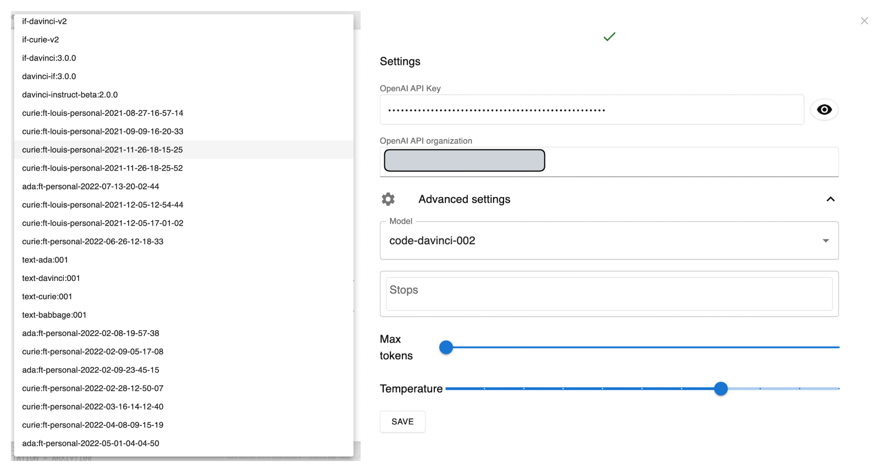

# obsidian-ava


⚠️ Extremely experimental code (but works) ⚠️

Currently runs OpenAI API and stable diffusion

## Stable diffusion

https://user-images.githubusercontent.com/25003283/194750149-b4e98e00-3855-4b22-9803-f41502bba871.mov

## GPT3 custom prompt (such as fixing grammar)

https://user-images.githubusercontent.com/25003283/198877691-74b9e60f-b621-4dfc-bfdc-a141149a1abd.mov


## Installation

1. See https://github.com/louis030195/obsidian-ava/issues/8 for installation
2. Setup your API keys in the settings
3. Set hotkeys / shortcuts for Ava the commands
4. To generate an image, write & select your prompt then press the Ava image generation hotkey you set
5. For GPT3/text, either enable autocompletion when you want or disable it and use [Templater](https://github.com/SilentVoid13/Templater).

### Settings



## GPT3 + [Templater](https://github.com/SilentVoid13/Templater)

The advantage of using [Templater](https://github.com/SilentVoid13/Templater) is that you can create your favorite prompts and prompt engineering techniques and use them in any note. 


### Selection completion


Create a script with the following content:

```js
const completeSelection = async () => {
    document.body.style.cursor = "wait";
    const msg = window.getSelection().toString();
    const response = await app.plugins.plugins["obsidian-ava"].openai.createCompletion({
        "model": "text-davinci-002",
        "prompt": msg,
        "temperature": 0.7,
        "max_tokens": msg.length + 100,
        "top_p": 1,
        "frequency_penalty": 0,
        "presence_penalty": 0
    })
    document.body.style.cursor = "default";
    return `${msg}${response.data.choices[0].text}`;

}
module.exports = completeSelection;
```

Then the template:

```md
<% tp.user.completeSelection() %>
```

Now you can select some text and execute the Templater template to the selected text grammar.


### Grammar fixer

Create a script with the following content:

```js
const fixGrammar = async () => {
    document.body.style.cursor = "wait";
    const msg = window.getSelection().toString();
    const response = await app.plugins.plugins["obsidian-ava"].openai.createCompletion({
        "model": "text-davinci-002",
        "prompt": "Correct this to standard English:\n\n" + msg,
        "temperature": 0,
        "max_tokens": msg.length + 100,
        "top_p": 1,
        "frequency_penalty": 0,
        "presence_penalty": 0
    })
    document.body.style.cursor = "default";
    return response.data.choices[0].text.trim();
}
module.exports = fixGrammar;
```

Then the template:

```md
<% tp.user.fixGrammar() %>
```

Now you can select some text and execute the Templater template to the selected text grammar.


### Description to stable diffusion

[Stable diffusion prompts are not very human friendly](https://mpost.io/best-100-stable-diffusion-prompts-the-most-beautiful-ai-text-to-image-prompts/) and usually require a bunch of prompt hacks to get good results.

Here is an example of using Templater to generate a Stable diffusion prompt using GPT3 based on a human description (selected text).


```js
// descriptionToArt.js

const descriptionToStableDiffusionPrompt = (description) => `Create a prompt for Stable Diffusion text-to-image deep learning model.

Description: An adventurer watching a beautiful landscape with a video game style.

Prompt: a lone skyscraper landscape vista photography by Carr Clifton & Galen Rowell, 16K resolution, Landscape veduta photo by Dustin Lefevre & tdraw, 8k resolution, detailed landscape painting by Ivan Shishkin, DeviantArt, Flickr, rendered in Enscape, Miyazaki, Nausicaa Ghibli, Breath of The Wild, 4k detailed post processing, atmospheric, hyper realistic, 8k, epic composition, cinematic, artstation –w 1024 –h 1280

###

Description: A beautiful African tribe woman.

Prompt: a hyper realistic character concept art of a beautiful african tribe woman, 4K symmetrical portrait,character concept art, oilpainting, Rendered in Octane,trending in artstation, cgsociety, 8k post-processing highly detailed,Junji Murakami, Mucha Klimt, Sharandula, Hiroshi Yoshida, Tom Bagshaw, Ross Tran, Artgerm,Craig Mullins,dramatic,Junji Murakami, moody lighting rendered by octane engine,characters 8K symmetrical arstation, cape,cinematic lighting, intricate details, 8k detail post processing, hyperealistic, octane rend, Zdzisław Beksiński style, ar 2:3 –uplight

###

Description: ${description}

Prompt:`;

const descriptionToArt = async () => {
    document.body.style.cursor = "wait";
    const selection = window.getSelection().toString();
    const response = await app.plugins.plugins["obsidian-ava"].openai.createCompletion({
        "model": "text-davinci-002",
        "prompt": descriptionToStableDiffusionPrompt(selection),
        "temperature": 0,
        "max_tokens": 200,
        "top_p": 1,
        "frequency_penalty": 0,
        "presence_penalty": 0,
        "stop": ["###", "\n"],
    })
    const stableDiffusionPrompt = response.data.choices[0].text.trim();
    console.log("about to call stableDiffusion with prompt: " + stableDiffusionPrompt);
    const outDir = app.vault.adapter.basePath + "/" + app.workspace.getActiveFile().parent.path;
    const {images} = await app.plugins.plugins["obsidian-ava"].stableDiffusion.generateAsync({
        prompt: stableDiffusionPrompt,
        apiKey: app.plugins.plugins["obsidian-ava"].settings.stableDiffusion.key,
        outDir: outDir,
        debug: false,
        samples: 1,
      });
    document.body.style.cursor = "default";
    // append image below
    return `${window.getSelection().toString()}\n\n![[${images[0].filePath.split("/").pop()}]]\n\n`;
}
module.exports = descriptionToArt;
```

```md
<% tp.user.descriptionToArt() %>
```

For example, 

```
A man confronts a robot in a chess game, he holds his head with his two arms as if he had a headache while the robot stares at him with its red eyes and its grinning face, announcing its dismal plans.
```

Generate

```
A man is playing chess against a robot, the robot is winning and the man is getting frustrated, the robot is taunting the man and the man is getting angry, the man is about to lose the game, 8k resolution, post processing, detailed, robot, chess, man, game, losing, frustrated, angry, taunting, red eyes, grinning face, plans, announcement, dismal, 8k
```


## TODOs

- [x] Provide an example to use GPT3 with [Templater](https://github.com/SilentVoid13/Templater) for endless prompt engineering
- [ ] optimise autocompletion UX (copy Github copilot UX/make it customisable, like triggered by a hotkey)
- [ ] implement DALLE-2 API (once it's available)
- [x] implement Stable diffusion API (https://beta.dreamstudio.ai)
- [ ] implement huggingface API / custom API
- [ ] local inference?
- [ ] [implement seeker somehow, internet augmented assistance](https://louis030195.medium.com/deploy-seeker-search-augmented-conversational-ai-on-kubernetes-in-5-minutes-81a61aa4e749)
