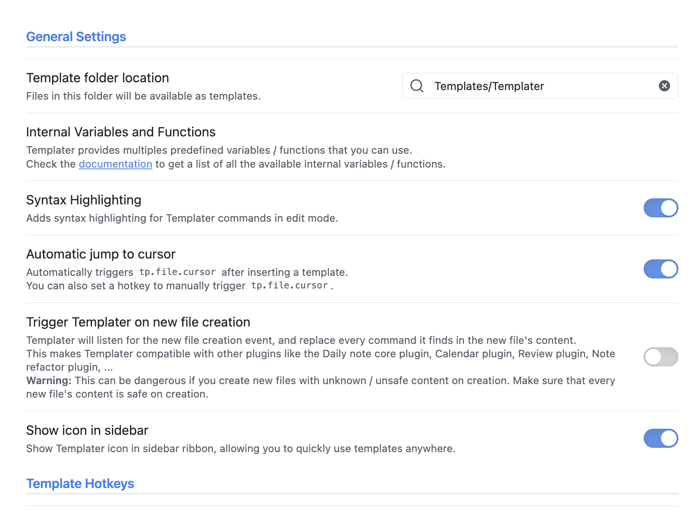
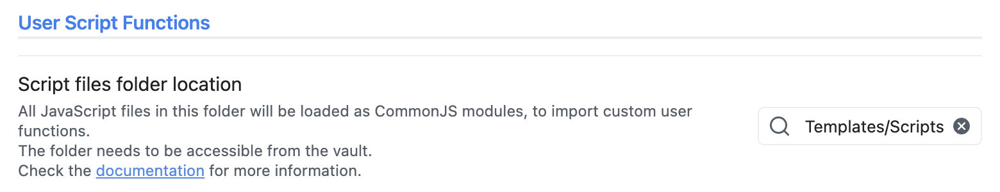

# Ava as a library

## In Templater

Ava can be used as a library in the plugin [Templater](https://github.com/SilentVoid13/Templater) (or in your own Obsidian plugin).


After installing Templater, place, for example, your templates in `Templates/Templater` and your scripts in `Templates/Scripts`. You can then use the scripts in your templates.




### Examples

**Text selection to image**

```md
<% tp.user.descriptionToArt() %>
```

```js
const descriptionToArt = async () => {
    document.body.style.cursor = "wait";
    const selection = window.getSelection().toString();
    console.log("about to call stableDiffusion with prompt: " + selection);
    const outDir = app.vault.adapter.basePath + "/" + app.workspace.getActiveFile().parent.path;
    const {imagePaths} = await app.plugins.plugins.ava.createImage({
        prompt: stableDiffusionPrompt,
        outputDir: outDir,
        size: 512,
      });
    if (imagePaths.length === 0) {
        new Notice('No image was generated');
        return;
    }
    document.body.style.cursor = "default";
    // append image below
    return `${window.getSelection().toString()}\n\n![[${imagePaths[0].split("/").pop()}]]\n\n`;
}
module.exports = descriptionToArt;
```

**Text selection to related notes as link**

⚠️ Make sure that you enabled links in Ava settings and ran the command "Load vault" once.

```md
<% tp.user.search() %>
```


```js
const search = async () => {
    new Notice('🧙 Ava Links - Searching for selection');
    const msg = window.getSelection().toString();
    const results = await app.plugins.plugins.ava.search({
        query: msg,
    });
    console.log(results);
    return msg + "\n\n" + results.similarities.map((result) => `- [[${result.note_path}]]`).join("\n");
}
module.exports = search;
```

**Text selection to Wikipedia links**

```md
<% tp.user.wikipedia(tp.file.title, tp.file.content) %>
````

```js
const wikipedia = async (title, text) => {
    document.body.style.cursor = "wait";
    const prompt = "Title: " + title + "\n" + text + "\nWikipedia links of similar topics:\n- https://";
    console.log("Prompt:", prompt);
    const completion = await app.plugins.plugins.ava.complete(prompt);
    console.log(completion);
    document.body.style.cursor = "default";
    return `\n\nSimilar topics Wikipedia URLs:\n\n- ${completion}`;
}
module.exports = wikipedia;
```

**Text selection to LaTex formula**

```md
<% tp.user.latex() %>
````

```js
const latex = async (title, text) => {
    document.body.style.cursor = "wait";
    const selection = window.getSelection().toString();
    const prompt = "Turn this into a LaTex formula: " + selection + "\n$",
    console.log("Prompt:", prompt);
    const completion = await app.plugins.plugins.ava.complete(prompt);
    console.log(completion);
    document.body.style.cursor = "default";
    return `${completion}`;
}
module.exports = wikipedia;
```


# Addtional information

You can check the complete code around https://github.com/louis030195/obsidian-ava/blob/main/src/main.tsx#L58.
